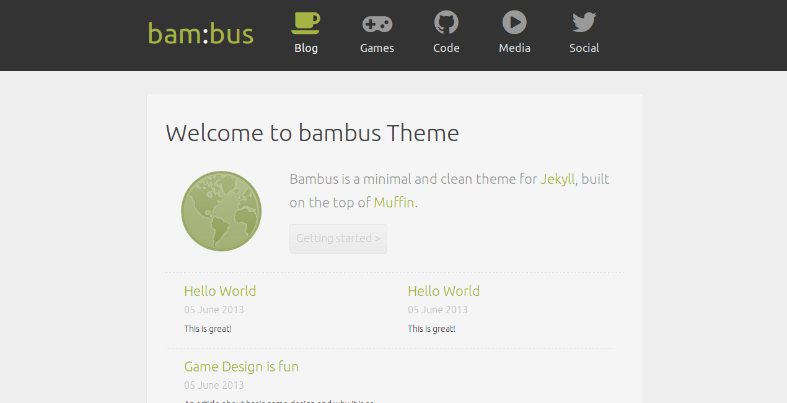

Muffin Bambus
===========


A [Muffin](http://www.richbray.me/muffin) template/theme applicable for Jekyll, written by [Miguel Gonzalez](https://github.com/MyRealityCoding).

Purpose
-------
Bambus is made for [the blog](http://my-reality.de) of Miguel Gonzalez. Any usage and modification and/or duplication is fully allowed.

Design
------


How to install
--------------

At first, download the latest version of bambus. Open the folder and make sure to run the install script before moving on:

```bash
sh install.sh
```

After that you should be able to visit your website on *http://localhost:4000*

How to build
------------

To build your website, run:

```bash
sh build.sh
```

How to update
--------------

To fetch the latest version of bambus simply run:

```bash
bash update.sh
```

Getting started
-----

You can customize the theme without changing code directly.

### Site title

You can change the default site title in the ```_config.yml``` file:

```yml
name: your:site
```
The colon ```:``` will be highlighted as white. It is recommended to use that because it fits in the theme of bam:bus.

### Navigation Menu

To change the links and icons of the navigation bar, simply modify the file ```_config.yml``` of Jekyll. bam:bus supports [FontAwesome icons](http://fortawesome.github.io/Font-Awesome/icons/). Here is an example how to define a custom link in the navigation bar:
```yml
navigation:
- text: Social
  title: Follow me @tweetmyreality
  url: https://twitter.com/tweetmyreality
  icon: icon-twitter
```

### Meta data

To have some information about your person and a small description, customize the following lines in the ```_config.yml```:

```yml
author:
  name: Miguel Gonzalez
  email: miguel-gonzalez@gmx.de>
  url: http://my-reality.de
  description: My <a>name</a>
  image: /img/bambus-icon.png
```

### Links

To add links in the footer, simply add the following lines into the file ```_config.yml```:

```yml
links:
- url: link
  name: Link1
- url: link
  name: Link2
- url: link
  name: Link3
```

Development
-----------
To get involved simply fork this theme and make your improvements. Additionally some of them are mentioned in the issues section of bambus or mail to [miguel-gonzalez@gmx.de](mailto:miguel-gonzalez@gmx.de).

Thanks to
---------
I want to thank [Richard Bray](http://www.richbray.me/) for providing an awesome design framework and [Amos Wenger](http://amos.me/) for inspiring me to create bam:bus.


